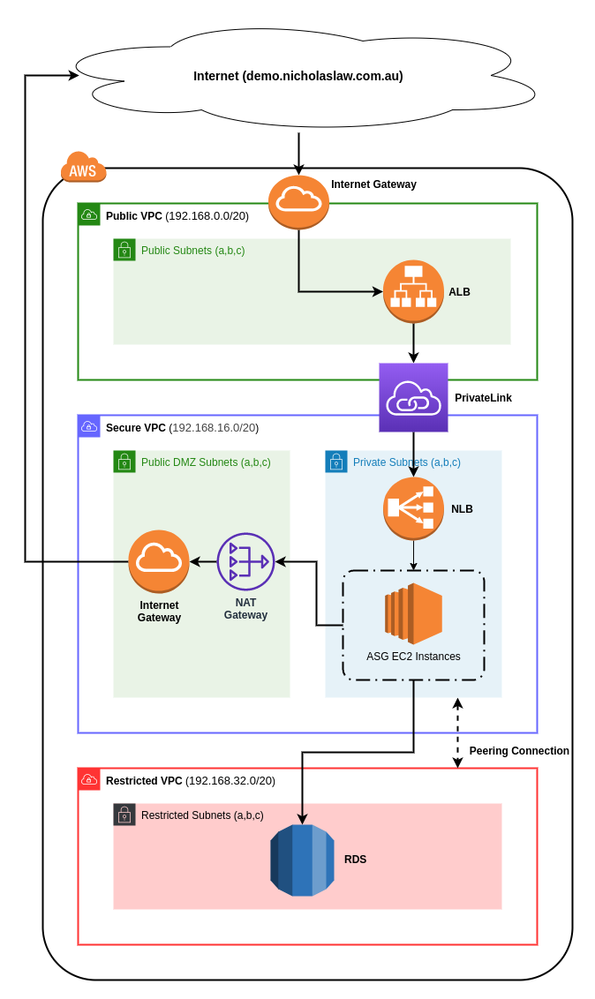

# stack-1

Visit http://demo.nicholaslaw.com.au/ for working demo.

See these repos also:

- Stack 2 - https://github.com/nicklaw5/stack-2
- Stack 3 - https://github.com/nicklaw5/stack-3

## AWS Infrastructure Topology



## Prerequisites

- Git (latest version preferred)
- Docker (latest version preferred)

## Assumptions, Disclaimers and Caveats

- All resources will be deployed to AWS region ap-southeast-2 (Sydney)
unless otherwise modified using the `AWS_DEFAULT_REGION` environment variable.
- Deleting Stack 1 using Terraform's `destroy` command will only remove
the S3 bucket if the there are no objects in the bucket.
- All commands and scripts have been constructed wih a Unix shell interpreter (primarily Bash)
in mind. You may be required to tweak each command/step to satisfy your operating environment.
- GitHub Actions was used as the CI/CD pipeline provider.

## Manual Steps

The only manual step was to created a IAM user called `deployer`, assign the following IAM
policies, and generate the access key and secret that would be used by GitHub Actions to
communicate with AWS and provision infrastructure:

- `IAMFullAccess`
- `AmazonS3FullAccess`
- `AmazonDynamoDBFullAccess`
- `AmazonSSMFullAccess`
- `AmazonVPCFullAccess`
- `AmazonEC2FullAccess`
- `AmazonRDSFullAccess`
- `AmazonRoute53FullAccess`

## Stack 1: Terraform S3 Backend & DynamoDB Locking

Stack 1 solves a "chicken before the egg" problem that occurs when using Terraform's
[S3 backend type](https://www.terraform.io/docs/backends/types/s3.html).
In order to take advantage of this backend type when performing CI/CD tasks, you need
to have two AWS resources already provisioned: a S3 bucket for storing Terraform state
files; and a DynamoDB table to support state locking when perform Terraform mutations.
But in order to deploy these resources they need to provisioned without the benefits of
CI/CD.

This repo attempts to solve that problem by deploying both a S3 bucket and DynamoDB table
without a CI/CD process. That is, the `terraform apply` command is run locally on the users
machine and the produced Terraform state file is committed to version control.

You could have accomplished the same using CloudFormation to provision these resources. However,
for this particular use case there are no secrets in the produced Terraform state file,
so there is no real harm in storing this file in plain text under source control. _Ideally_
your git repository is also not publicly visible.

The following steps were taken to deploy this stack:

```bash
# 1. Set common script environment varaibles (substitute AWS key and secret appropriately)
export TERRAFORM_DIR=terraform
export TERRAFORM_VERSION=0.12.23
export AWS_DEFAULT_REGION=ap-southeast-2
export AWS_ACCESS_KEY_ID=<redacted>
export AWS_SECRET_ACCESS_KEY=<redacted>

# 2. Initialise Terraform providers
./scripts/terraform_init.sh

# 3. Validate Terraform configuration
./scripts/terraform_validate.sh

# 4. Generate Terraform plan
./scripts/terraform_plan.sh

# 5. Apply Terrform plan
./scripts/terraform_apply.sh

# 6.Commit Terraform state file (and any other changes)
git commit -am "Updated stack 1"
git push
```

With the Terraform backend and locking configured, both Stack 2 and Stack 3 can leverage
Terraform using GitHub Actions and CI/CD.

## Stack 2: VPCs & Subnets

See https://github.com/nicklaw5/stack-2

Stack 2 configures the VPCs, VPC peering, subnets, internet gateways, the NAT gateway, and
route tables. It uses GitHub Actions for CI/CD.

## Stack 3: Load Balacers, ASGs & RDS

See https://github.com/nicklaw5/stack-3

Stack 3 configures the two load balancers, the PrivateLink, the ASG, the RDS instance. It uses GitHub Actions
for CI/CD.

### Do I know the EC2 instances have access to the RDS instance?

There is a [user_data script](https://github.com/nicklaw5/stack-3/blob/master/terraform/templates/user_data.sh)
that runs a `SELECT 1` query to the RDS instance as part of the instance boot sequence. If that select
statement was to fail then the Python HTTP server would not run.

Additionally you can check the instance system/boot logs from within the AWS console:

1. Go EC2 in the AWS console
1. Right the instance you want to check
1. Hover over "Instance Settings"
1. Click "Get System Log"
1. Toward the bottom of the logs you will find the following lines:

    ```txt
    [   56.396316] cloud-init[1376]: ==> Checking DB connection...
    [   56.678123] cloud-init[1376]: DB_CONNECTION: 1
    ```

### How can I trigger the ASG to scale?

There is a small Bash script that can be found [here](https://github.com/nicklaw5/stack-3/blob/master/curl-loop.sh).
Run it for a few minutes and the ASG will scale up. Once you stop running the script, after a
few minutes the ASG will scale back down.

### Why use a PrivateLink?

It is not trivial for a load balancer in one VPC and an ASG in a different VPC to communicate
very easily. For one, it's not possible for an ALB in one VPC to attach a target group (TG) in another
VPC. Secondly, if the ALB and TG did reside in the same VPC, with the ASG in another, it would
need to be a IP TG, rather than a instance TG. This would mean that every time an instance scaled up or
down, it would somehow have to update the TG with new private IP or remove the old private IP, respectively.

The PrivateLink solves this by creating a secure private connection between the ALB in the public VPC and
the ELB in the secure VPC. This allows for the ASG to scale based on instance ID, and automatically updates
the ELBs target group.

## Future Improvements

- Add TLS termination to both the ALB and the NLB
- Don't provision the Route53 zone in Stack 3. It should have it's own stack.
- Don't provision the RDS instance in Stack 3. It should have it's own stack.
